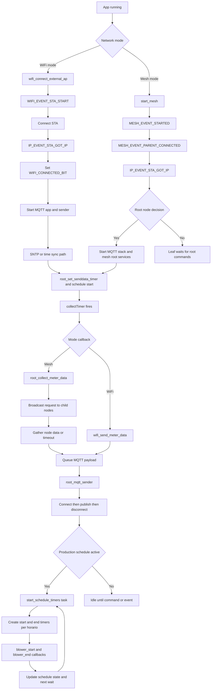

 📝  🚀🔥✨❤️💼🏠📣🧑‍💻

# Program Flow

General description of the Flow of Routines in the application in words vs a Flowchart

## app_main

As is normal, entry point of app. THis is a cpp (C++) so in the includes.h forlder there is an entry for extern "C" {void app_main()}

- It will determine partially the program flow, speciality at the begining

### Initial booting phase 🚀

    - flashsem & i2cSem created here since it controls access to Flash for all tasks and will immediately be used
    - NVS as per usual
    - read flash to get configurations and centinel guard. If no CENTINEL Erase/configure the Flash to defaults
    - Sanity checks for hardware
    - Init a bunch of variables, queues, etc. No tasks launched. See init vars routine

##### Main Task launched. main_app()

    - This is the meat and bones of this Application.
    - Will get pulses from up to 8 meters and begin managing them, save to Fram etc
    - very simple rotuine, works on thersholds, for each Meter 1/10 of their BPK as upper limit
    - connect HW like FRAM and I2... Fram Failure is FATAL🔥🔥🔥
    - infinite loop

#### Kbd task launched if debug mode set in defines.h,

    - extremely helpful to debug, work. Not necessary on final production but.....
    - It can launch tasks, but is not part of the main logic concern. Just a tool to test features and configurations

### Configuration checks 📝

    -- Check Provison state(skippable) and Meter Config (compulsorty)
    -- If clean code/MCU will try to PROV so it will be a Main Root
    ---🔥 Its skippable for a non main Root node (first MESH configuration)
    -- ✨If OLED attached it can be reached via Menu Option (long flash button)

### OLED Manager

    - Task is launched. Very independent does not get involved in functionality
    - Outer "Loop" check for short click (Flash Btn)
    -- short will show next Meter data
    -- long will take to Config Menu📝

### MESH 🚀

    - Mesh is now started
    -- It will start a very intricate set of  ewvent driven conditions
    -- WiFi is managed by mesh routines
        • MAIN ROOT node (first config of MESH) will send STA/PSW
            too child nodes in case of Roots death
        • WHen  event ✨got_IP✨ if node is ROOT🔥 it will start
            • MQTT app start in charge fo MQTT
                • once done, SNTP to get time

### RUNNING

    -- THe Main Task Pulse counter keeps count of all Meters and
        saves datra to FRAM
    -- A repeated timer every CYCLE ms is in charge of sending Readinmg to HQ

#### Data Management

    -- When timer awakes, ROOT Node will send a Broadcast Msg to all nodes
            to send their meters data
        -- will wait for all connected Nodes or Timeout and send what it has
        -- MQTT manager is on a Need Basis
         ✨Connect -> Send _> Disconnect✨  no permanete connection
        CHECK DOCUMENTATION OF THIS ROUTIME

## App Flowchart (Mermaid)

```mermaid
flowchart TD
    A[app_main entry] --> B[init_process and app_spiffs_log]
    B --> C{temp sensor enabled}
    C -->|Yes| C1[Start ds18b20_task]
    C -->|No| D[Init Blower state]
    C1 --> D[Init Blower state]

    D --> E{wifi mode disabled}
    E -->|Yes| E1[Start time_keeper_task]
    E -->|No| F[Boot log and optional keyboard task]
    E1 --> F[Boot log and optional keyboard task]

    F --> G{meterconf equals zero}
    G -->|Yes| G1[Format FRAM and blink config]
    G1 --> G2[meter_configure]
    G2 --> G3[Stop blink and write config]
    G -->|No| H{meterconf greater than two}
    G3 --> H
    H -->|Yes| H1[blinkConf and meter_configure]
    H -->|No| I[Continue startup]
    H1 --> I[Continue startup]

    I --> J{mesh mode enabled}
    J -->|Yes| J1[Start root_timer task]
    J -->|No| K[Skip root_timer]
    J1 --> L{modbus enabled}
    K --> L{modbus enabled}
    L -->|Yes| L1[Start rs485_task_manager]
    L -->|No| M[Network startup branch]
    L1 --> M[Network startup branch]

    M --> N{wifi mode disabled}
    N -->|Yes| N1[wifi_connect_external_ap]
    N1 --> N2[Start webserver task]
    N2 --> P{gps sensor enabled}
    N -->|No| N3[start_mesh and set loginwait]
    N3 --> P{gps sensor enabled}

    P -->|Yes| P1[Init NMEA parser and GPS handler]
    P -->|No| Q[Log free heap]
    P1 --> Q[Log free heap]
    Q --> R[Run time behavior via events, timers, and tasks]
```

## Runtime Event Flow (Mermaid)

